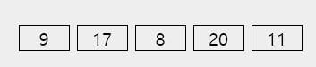
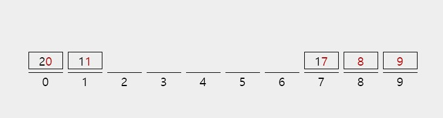
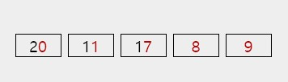
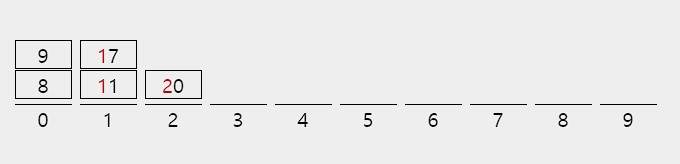
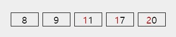
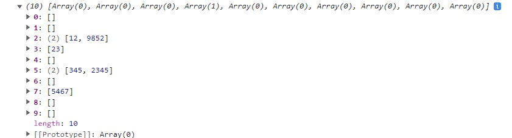
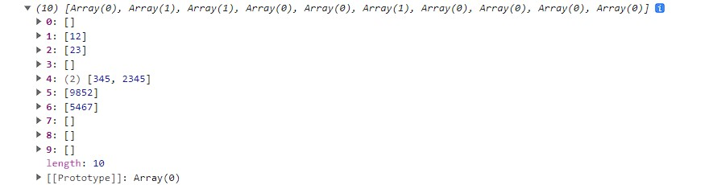
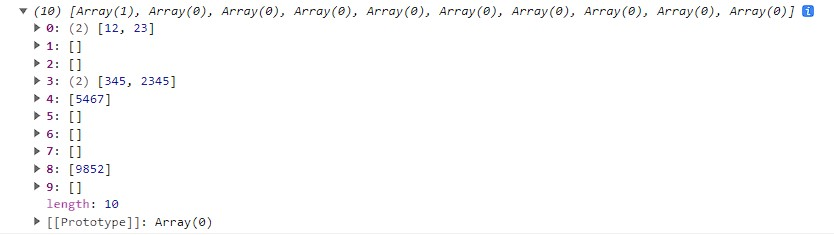
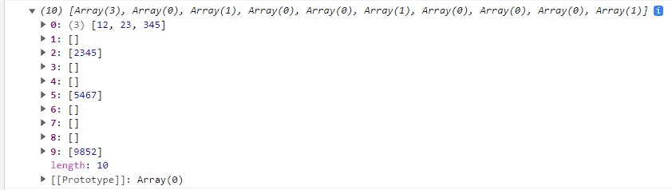

# 기수 정렬
리스트의 요소들 끼리 비교를 하여서 정렬을 하는 방식이 아닌 버킷을 사용해 정렬을 하는 방식으로 요소의 낮은 자릿수 부터 높은 자릿수 순서로 버킷에 넣고 정렬을 한다.

<br>
정렬이 안된 리스트<br>

<br>
요소의 첫번째 자릿수를 버켓에 분리해서 담는다<br>
<br>
버켓에 맞춰서 정렬을 한다.<br>
<br>
요소의 두번째 자릿수를 버켓에 분리해서 담는다<br>
<br>
버켓에 맞춰서 정렬을 한다.<br>
가장 값이 큰 요소의 자릿수 만큼 반복을 하면 정렬이 되는 특징이 있다.

## 구현
##### 자릿수 함수
* 버킷에 분류하기 위해서는 자릿수에 어떤 숫자가 해당하는 지 알아야 한다.
* 정렬에 소요되는 총 횟수는 가장 큰 요소의 자릿수와 같음으로 이것을 파악해내는 함수가 필요하다.

```javascript
// n번째 자릿수에 오는 숫자를 구하는 함수 (첫번째 자리 = 0 부터)
const getNthDigit = (num, n) => {
  return Math.floor(Math.abs(num) / Math.pow(10, n)) % 10;
}
getNthDigit(325, 0)
// 5

// 해당 숫자의 자릿수를 알려주는 함수
const digitCount = (num) => {
  if (num === 0) return 1
  return Math.floor(Math.log10(Math.abs(num))) + 1;
}

// 배열의 가장 큰 숫자 자릿수를 알려주는 함수
const maxDigitCount = (arr) => {
  let maxDigitCount = 0;
  for (let i = 0; i < arr.length; i++) {
    maxDigitCount = Math.max(maxDigitCount, digitCount(arr[i]))
  }
  return maxDigitCount;
}
```
##### 기수 정렬
1. 최대 자릿수를 구해서 루프를 만듬
2. 배열의 요소를 분류 할 수 있는 버킷을 만든다.
3. 조건에 맞게 배열을 순회하면서 해당하는 자릿수에 맞는 버킷에 넣어준다

```javascript
const radixSort = (arr) => {
  //최대 자릿수
  let maxDigitCountInArray = maxDigitCount(arr);

  for (let i = 0; i < maxDigitCountInArray; i++) {
    //0~9 까지의 키와 빈배열을 가진 2차원 배열 생성 = 버킷
    let buckets = Array.from({ length: 10 }, () => []);
    for (let j = 0; j < arr.length; j++) {
      let digit = getNthDigit(arr[j], i);
      buckets[digit].push(arr[j])

    }
    arr = [].concat(...buckets)
  }
  return arr;
}

radixSort([23, 345, 5467, 12, 2345, 9852]);
//  [12, 23, 345, 2345, 5467, 9852]
```






<br>
자릿수의 순서에 따라 버킷에 담겨서 정렬이 되는 모습을 알 수가 있다.
